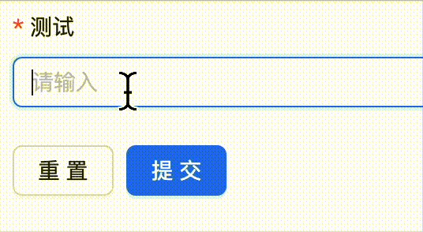

提问前先看看：

https://github.com/ryanhanwu/How-To-Ask-Questions-The-Smart-Way/blob/main/README-zh_CN.md

### 🐛 bug 描述

```tsx
import { ProForm, ProFormText } from "@ant-design/pro-components";
```
使用 ProFormText 组件在触发表单校验会让页面闪一下



### 📷 复现步骤

直接使用 ProFormText 组件就会有

### 🏞 期望结果

期望没有闪烁

### 💻 复现代码

```tsx
import { ProForm, ProFormText } from "@ant-design/pro-components";

const AddAppAcc = () => {
  return (
    <ProForm>
      <ProFormText
        rules={[
          {
            required: true,
            message: "测试校验",
          },
        ]}
        name="name"
        label="测试"
      />
    </ProForm>
  );
};

export default AddAppAcc;
```

### © 版本信息

- "@ant-design/pro-components": "^2.8.3"
- "antd": "^5.23.0"
- "react": "^18.3.1"
- "react-dom": "^18.3.1"
- Chrome 版本 131.0.6778.205（正式版本） (arm64)
- node v20.15.1
- [MacOS]
